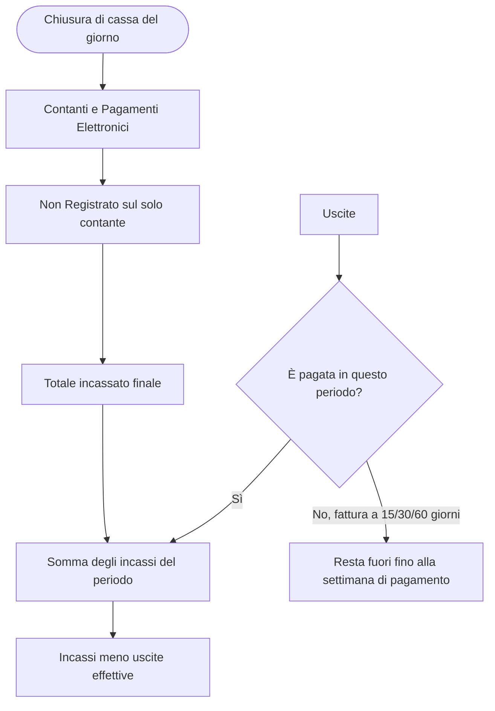

# Sintesi — intervista, analisi, bozza di soluzione

Unisce l'output ENGenius ANALYSIS e l'esito IMPACT. La cliente tiene la cassa di un'attività con fornitori e quattro tipi di costo delle persone. Oggi annota i numeri e chiude settimana e mese a mano. L'app deve fare quelle somme, con la regola che una fattura pesa nel periodo in cui viene pagata.

## Da dove arrivano le due analisi

| Lente | Cosa è stato fatto | Dove sta |
|---|---|---|
| ENGenius ANALYSIS | Bisogni, requisiti, capacità, casi d'uso, scenari e qualità, solo dall'intervista | `artifacts/Contabile/analysis/` |
| IMPACT | Non eseguito | `docs/IMPACT_PRECONDIZIONE.md` |

IMPACT legge un codebase. Qui non c'è codice e non c'è git. I flussi più sotto sono la lettura dell'intervista, non processi estratti da sorgenti.

DocMind non è collegato. Tutto è in bozza locale (`ANALYSIS_DRAFT`). Non è una specifica approvata e non è la fase DESIGN della pipeline: quella parte dopo il function point sizing.

Il committente tecnico ha chiesto una web app. La cliente ha chiesto «un'app unica». Nel seguito «web» è la forma di consegna indicata da te, non una frase della cliente.

## Le tre formule

Sono le uniche regole di calcolo dette in modo esplicito.

1. **Non Registrato** = contante fisico in cassa − contante registrato dalla chiusura di cassa.
2. **Totale incassato finale del giorno** = totale della chiusura + Non Registrato.
3. **Chiusura di periodo** (settimana, e il mese con lo stesso criterio) = somma degli incassi giornalieri del periodo − uscite effettive del periodo.

Un'uscita è effettiva quando è pagata. Una fattura registrata ma non pagata non si sottrae. Si sottrae nella settimana — e quindi nel mese — in cui viene pagata. La merce senza fattura, per esempio dal mercato, si paga subito e non ha i rinvii a 15, 30 o 60 giorni.

Esempio di lettura, con numeri inventati solo per controllare la formula:

| Voce | Importo |
|---|---|
| Contanti in chiusura | 400 |
| Pagamenti elettronici | 600 |
| Totale chiusura | 1.000 |
| Contante fisico in cassa | 450 |
| Non Registrato (450 − 400) | 50 |
| Totale incassato finale | 1.050 |

Se in quella settimana c'è una fattura da 200 non pagata e una spesa al mercato da 30 già pagata, la chiusura sottrae 30, non 200.

## Cosa entra e cosa no

Uscite che la cliente vuole caricare, tutte distinte:

- fattura fornitore (numero, data, importo, subito oppure 15/30/60 giorni)
- merce senza fattura
- bollette utenze
- affitto
- F24 del titolare, che non è un dipendente effettivo
- contributi del collaboratore
- costo del dipendente con busta paga regolare
- ritenuta d'acconto dell'occasionale

L'unica persona che inserisce dati è la titolare. Fornitore e dipendenti compaiono come soggetti, non come utenti.

## Bozza di soluzione, da rivedere insieme

Quattro schermate, una sola applicazione web.

**Giornata.** Una data. Contanti, pagamenti elettronici, totale chiusura, contante in cassa, Non Registrato, totale finale. Il totale finale è calcolato, non digitato.

**Uscite.** Una lista con il tipo tra gli otto sopra. Sulla fattura: numero, data, importo, termine. Azione separata «segna come pagata» con la data di pagamento, perché è quella data che decide la settimana. Sulla merce senza fattura il termine non c'è: nasce già pagata.

**Settimana e mese.** Stessa griglia: incassi, uscite pagate nel periodo, fatture aperte mostrate ma non sottratte, risultato.

**Dashboard.** Oggi, settimana corrente e mese corrente, letti dalle stesse registrazioni.

Modello minimo, senza anagrafiche che la cliente non ha chiesto:

- `ChiusuraGiornaliera`: data, contanti, pagamenti elettronici, totale chiusura, contante in cassa, non registrato, totale finale calcolato
- `Uscita`: tipo, importo, data documento, data pagamento (vuota se la fattura è ancora aperta), numero fattura solo se il tipo è fattura, termine solo se il tipo è fattura

Non propongo login multipli, IVA, prima nota o export. Non sono nell'intervista.

## Dove le due letture si incontrano

| Tema dell'intervista | ENGenius | IMPACT |
|---|---|---|
| Cassa, Non Registrato, totale del giorno | BR-001…003, FR-001…003, UC-001 | Nessun codice da cui estrarre il processo |
| Fattura subito o a 15/30/60, merce senza fattura | BR-004…005, FR-004…006, FR-014, UC-002, UC-003, UC-006 | Idem |
| Bollette, affitto, quattro costi persone | BR-006, FR-007…012, UC-004, UC-005 | Idem |
| Settimana, mese, dashboard | BR-007…009, FR-013…017, UC-007…009 | Idem |
| Architettura, stack, debito, function point sul codice | Fuori dalla fase ANALYSIS | Rinviato al primo codebase |

## Punti da chiarire prima di disegnare sul serio

1. Non Registrato: la titolare inserisce contante in cassa e contante da chiusura, oppure solo la differenza già fatta? La differenza può essere negativa?
2. Il totale della chiusura è sempre Contanti + Pagamenti Elettronici, o può inserire un totale diverso dal dettaglio?
3. «Incassi giornalieri» nella settimana sono il totale finale (con Non Registrato) o il solo totale della chiusura?
4. La settimana parte di lunedì? Il mese è il mese civile?
5. «Segnare tutto» sulla busta paga: quali voci (netto, contributi, ritenute, altro)?
6. «Caricare» bollette e contributi significa annotare l'importo, oppure allegare anche il PDF?
7. Bollette, affitto, F24 e costi persone si registrano solo quando si pagano, o anche loro possono restare aperti come le fatture?
8. Una fattura si può pagare in parte, o sempre per intero in un giorno?
9. I quattro profili sono sempre quelle quattro persone, o il numero può cambiare?
10. C'è una sola cassa? Serve più di un utente?

Finché 1, 3 e 7 non sono chiari, il calcolo di settimana e mese può uscire diverso da quello che fa oggi a mano.

## Prossimo passo

Confermare o correggere questa bozza con la cliente. Poi, in pipeline, si può approvare l'ANALYSIS e andare a test e function point. Il design formale e il codice vengono dopo. IMPACT riparte quando c'è qualcosa da leggere nel repository.
